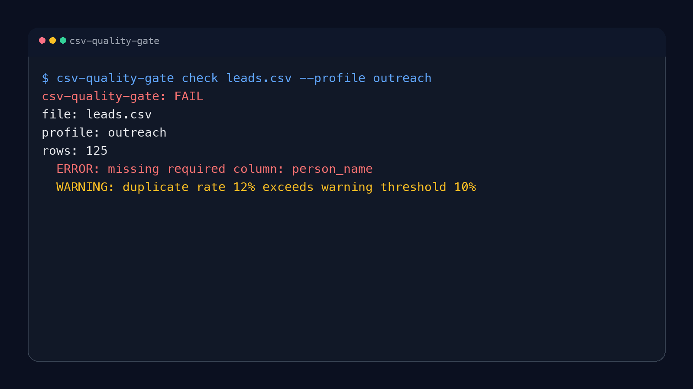

# csv-quality-gate: CSV preflight validation before pipeline runs

Fail fast before pipeline runs when the input CSV is broken, incomplete, duplicated, or obviously junk.

`csv-quality-gate` runs batch CSV quality checks and returns `pass`, `warn`, or `fail` before expensive pipeline steps burn time on bad input.

- "We keep running expensive pipeline steps on broken CSVs."
- "A batch run fails 20 minutes in because the input CSV was junk."
- "We only discover missing required columns after the job already started."
- "Duplicate rows and empty contact fields keep polluting our batch runs."
- "I want CSV preflight validation, not a whole data platform."

Fastest install:

```bash
pip install csv-quality-gate
```

Fastest real usage:

```bash
csv-quality-gate check leads.csv --profile outreach
```

Exact outcome:

```text
csv-quality-gate: FAIL
file: leads.csv
profile: outreach
rows: 125
  ERROR: missing required column: person_name
  WARNING: duplicate rate 12% exceeds warning threshold 10%
```



It is designed for narrow, honest use as a preflight gate, not as a full data quality platform.

## Install

```bash
pip install csv-quality-gate
```

For development:

```bash
pip install -e ".[dev]"
```

## Common search-intent use cases

- CSV preflight validation
- batch CSV quality checks
- fail fast before pipeline runs
- CSV validation before ETL or enrichment
- detect junk CSV rows before batch jobs

## Usage

```bash
csv-quality-gate check leads.csv
csv-quality-gate check leads.csv --profile outreach
csv-quality-gate check leads.csv --profile generic --json
```

Exit codes:

- `0` pass
- `1` warnings only
- `2` fail

## Profiles

Built-in profiles:

- `generic`
  - validates required columns, empties, duplicates, empty file
- `outreach`
  - adds suspicious company-name heuristics for GTM/contact pipelines

## Output

```text
csv-quality-gate: FAIL
file: leads.csv
profile: outreach
rows: 125
  ERROR: missing required column: person_name
  WARNING: duplicate rate 12% exceeds warning threshold 10%
```

## JSON mode

```bash
csv-quality-gate check leads.csv --json
```

## Limitations

- Heuristics are intentionally simple.
- The `outreach` profile is opinionated and should not be treated as universal truth.
- The tool validates shape and obvious noise, not semantic correctness.

## When To Use It

- Before enrichment, outreach, ETL, or batch scoring runs
- In CI for checked-in CSV inputs
- As a preflight gate before expensive pipeline work

## When Not To Use It

- When you need semantic validation of the data itself
- When your input is not CSV
- When you need a full data quality framework with lineage and profiling

## Development

```bash
ruff check .
python3 -m pytest -q
python3 -m py_compile src/csv_quality_gate/*.py
```

---

## About Hermes Labs

[Hermes Labs](https://hermes-labs.ai) builds AI audit infrastructure for enterprise AI systems — EU AI Act readiness, ISO 42001 evidence bundles, continuous compliance monitoring, agent-level risk testing. We work with teams shipping AI into regulated environments.

**Our OSS philosophy — read this if you're deciding whether to depend on us:**

- **Everything we release is free, forever.** MIT or Apache-2.0. No "open core," no SaaS tier upsell, no paid version with the features you actually need. You can run this repo commercially, without talking to us.
- **We open-source our own infrastructure.** The tools we release are what Hermes Labs uses internally — we don't publish demo code, we publish production code.
- **We sell audit work, not licenses.** If you want an ANNEX-IV pack, an ISO 42001 evidence bundle, gap analysis against the EU AI Act, or agent-level red-teaming delivered as a report, that's at [hermes-labs.ai](https://hermes-labs.ai). If you just want the code to run it yourself, it's right here.

**The Hermes Labs OSS audit stack** (public, open-source, no SaaS):

**Static audit** (before deployment)
- [**lintlang**](https://github.com/hermes-labs-ai/lintlang) — Static linter for AI agent configs, tool descriptions, system prompts. `pip install lintlang`
- [**rule-audit**](https://github.com/hermes-labs-ai/rule-audit) — Static prompt audit — contradictions, coverage gaps, priority ambiguities
- [**scaffold-lint**](https://github.com/hermes-labs-ai/scaffold-lint) — Scaffold budget + technique stacking. `pip install scaffold-lint`
- [**intent-verify**](https://github.com/hermes-labs-ai/intent-verify) — Repo intent verification + spec-drift checks

**Runtime observability** (while the agent runs)
- [**little-canary**](https://github.com/hermes-labs-ai/little-canary) — Prompt injection detection via sacrificial canary-model probes
- [**suy-sideguy**](https://github.com/hermes-labs-ai/suy-sideguy) — Runtime policy guard — user-space enforcement + forensic reports
- [**colony-probe**](https://github.com/hermes-labs-ai/colony-probe) — Prompt confidentiality audit — detects system-prompt reconstruction

**Regression & scoring** (to prove what changed)
- [**hermes-jailbench**](https://github.com/hermes-labs-ai/hermes-jailbench) — Jailbreak regression benchmark. `pip install hermes-jailbench`
- [**agent-convergence-scorer**](https://github.com/hermes-labs-ai/agent-convergence-scorer) — Score how similar N agent outputs are. `pip install agent-convergence-scorer`

**Supporting infra**
- [**claude-router**](https://github.com/hermes-labs-ai/claude-router) · [**zer0dex**](https://github.com/hermes-labs-ai/zer0dex) · [**forgetted**](https://github.com/hermes-labs-ai/forgetted) · [**quick-gate-python**](https://github.com/hermes-labs-ai/quick-gate-python) · [**quick-gate-js**](https://github.com/hermes-labs-ai/quick-gate-js) · [**repo-audit**](https://github.com/hermes-labs-ai/repo-audit)
