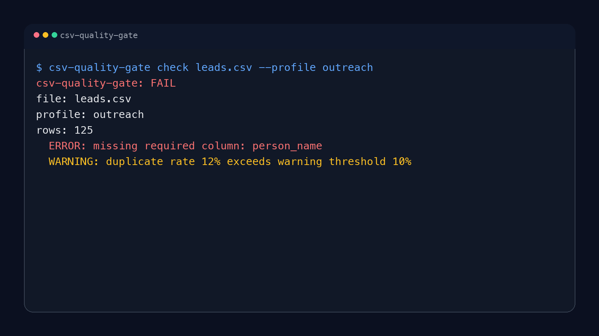

# csv-quality-gate

[](https://github.com/hermes-labs-ai/csv-quality-gate/actions/workflows/ci.yml)
[](https://pypi.org/project/csv-quality-gate/)
[](https://pypi.org/project/csv-quality-gate/)
[](LICENSE)

csv-quality-gate is a command-line data quality gate that runs CSV preflight validation, failing fast before a pipeline ingests broken, incomplete, duplicated, or junk input.

It runs batch quality checks on a single CSV and returns `pass`, `warn`, or `fail` (with matching exit codes) before expensive pipeline steps burn time on bad input. It checks for missing required columns, empty files, empty critical cells, duplicate rows, and — under the `outreach` profile — suspicious company-name patterns. It is stdlib-only: no third-party runtime dependencies.

The problems it is built for:

- "We keep running expensive pipeline steps on broken CSVs."
- "A batch run fails 20 minutes in because the input CSV was junk."
- "We only discover missing required columns after the job already started."
- "Duplicate rows and empty contact fields keep polluting our batch runs."
- "I want CSV preflight validation, not a whole data platform."

## Quickstart (60 seconds)

```bash
pip install csv-quality-gate
csv-quality-gate check leads.csv --profile outreach
```

Example output for a CSV with a missing column and a borderline duplicate rate:

```text
csv-quality-gate: FAIL
file: leads.csv
profile: outreach
rows: 125
  ERROR: missing required column: person_name
  WARNING: duplicate rate 12% exceeds warning threshold 10%
```

The process exits `0` on pass, `1` on warnings only, and `2` on fail, so you can wire it directly into a shell script or CI step.



## Install

```bash
pip install csv-quality-gate
```

For development:

```bash
pip install -e ".[dev]"
```

## Usage

```bash
csv-quality-gate check leads.csv
csv-quality-gate check leads.csv --profile outreach
csv-quality-gate check leads.csv --profile generic --json
```

Exit codes:

- `0` pass
- `1` warnings only
- `2` fail (or `2` when the file does not exist)

## Profiles

Built-in profiles:

- `generic`
  - checks for a required `company` column, empty `company` cells, duplicate `company` values, and empty files
- `outreach`
  - requires `company` and `person_name`, with higher empty-rate tolerances and an added suspicious company-name heuristic for GTM/contact pipelines

The thresholds for each profile are defined in `src/csv_quality_gate/profiles.py`.

## Output

Text mode (default):

```text
csv-quality-gate: FAIL
file: leads.csv
profile: outreach
rows: 125
  ERROR: missing required column: person_name
  WARNING: duplicate rate 12% exceeds warning threshold 10%
```

JSON mode (`--json`) emits an object with `path`, `profile`, `rows`, `status`, and `issues[]`:

```bash
csv-quality-gate check leads.csv --json
```

## Limitations / What it does not do

- Heuristics are intentionally simple: empty-rate, duplicate-rate, and regex-based name patterns. They do not learn from your data.
- It validates shape and obvious noise, not semantic correctness — it cannot tell whether `company` values are real, only whether they are present, unique, and not obviously junk.
- The `outreach` profile is opinionated. Its suspicious-name patterns and thresholds were chosen for GTM contact lists and should not be treated as universal truth.
- Duplicate and empty checks operate on a fixed set of columns per profile (`company`, `person_name`); it does not auto-detect which columns matter.
- It validates one CSV file at a time and assumes UTF-8 (BOM-tolerant) input.
- It is not a data quality platform: no lineage, no profiling reports, no schema inference, no row-level remediation.

## When to use it

- Before enrichment, outreach, ETL, or batch scoring runs
- In CI for checked-in CSV inputs
- As a preflight gate before expensive pipeline work

## When not to use it

- When you need semantic validation of the data itself
- When your input is not CSV
- When you need a full data quality framework with lineage and profiling

## CI / GitHub Actions

A ready-to-copy workflow lives in [`examples/github-action.yml`](examples/github-action.yml). It installs the package and runs a check so a bad checked-in CSV fails the build.

## Development

```bash
pip install -e ".[dev]"
ruff check .
python3 -m pytest -q
```

## Part of the Hermes Labs reliability stack

csv-quality-gate is part of the [Hermes Labs](https://github.com/hermes-labs-ai) reliability stack — open-source tools that catch silent failure modes in production AI and data pipelines. csv-quality-gate guards the data that goes into a pipeline; it is complementary to, not a replacement for, the agent- and prompt-level tools in the stack.

## About Hermes Labs

Hermes Labs is an independent AI-reliability lab building open-source tools that catch silent failure modes in production AI. More at [hermes-labs.ai](https://hermes-labs.ai).

## License

MIT — see [LICENSE](LICENSE).

## Citation

If you use this software, please cite it using the metadata in [`CITATION.cff`](CITATION.cff).
